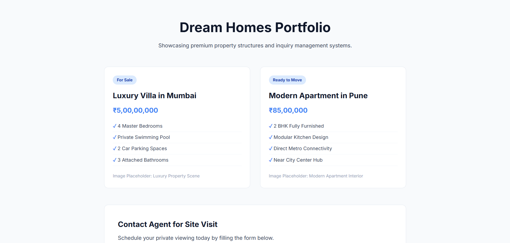
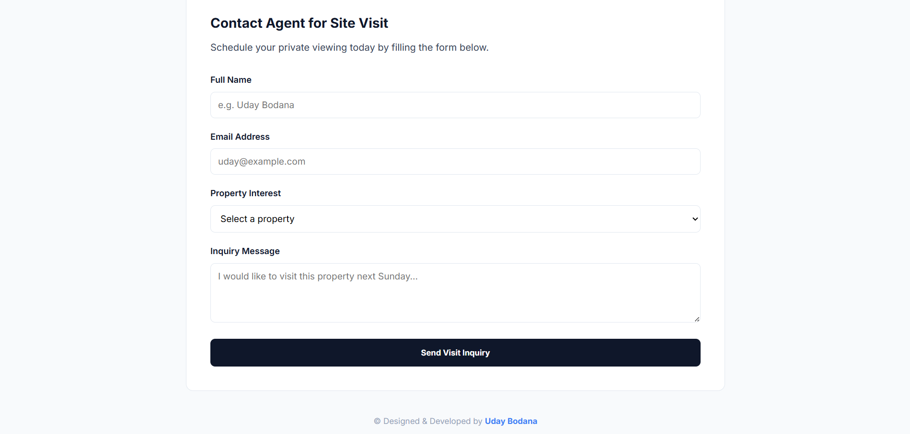

# 🏡 Real Estate

A structured, elegant, and premium real estate portfolio page. Showcases beautiful property listings alongside a highly professional inquiry form for booking direct site visits.

---

## ✨ Features

- **Dynamic Property Grid:** A fully responsive property grid powered by modern CSS Grid.
- **Premium Interface:** Custom cards with status badges, interactive lift effects on hover, and smooth shadows.
- **Detailed Features Checklist:** Clean, visual checklist of property amenities.
- **Integrated Inquiry Form:** Feature-rich booking and contact form supporting name, email, dropdown selections, and text areas.
- **Responsive Layout:** Tailored to perform seamlessly across both mobile and desktop views.

---

## 🚀 How to Use

1. **Browse Listings:** Scan property cards to view distinct options, pricing, and available amenities.
2. **Review Details:** Look through the modern checklist section for in-depth insights into each listing.
3. **Inquire:** Complete the inquiry form to book a visit or contact the agent directly.

---

## 💻 Tech Stack

- **HTML5**
- **CSS3**

---

## 🏃 How to Run

1. Clone or download this repository.
2. Open `index.html` directly in any web browser, or use a local development server like **Live Server** in VS Code.

---

## 📸 Preview

---

© Designed & Developed by **Uday Bodana**